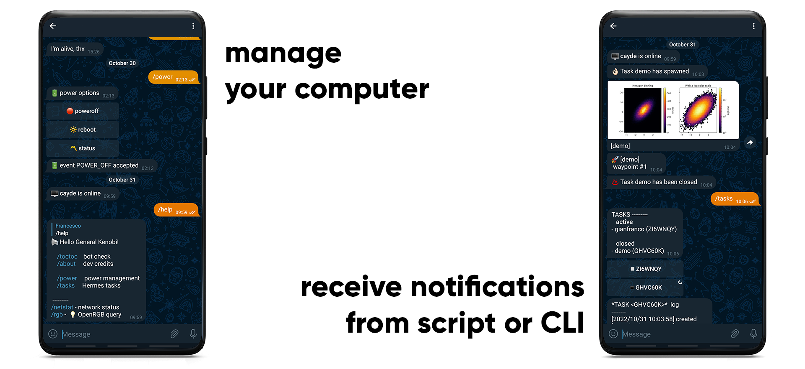

<h1 align="center">hermes</h1>

Telegram bot for messages, task notifications & system management.

 

    

## What can Hermes do?

Hermes is a python library that provides a Telegram bot interface for your computer.
It is capable of sending messages, files or images to a specific user, either via terminal commands or inside python scripts.
Additionally, it can run as a server that interacts with specific commands received through the Telegram bot. 

In detail, the functionalities of Hermes are developed around three core blocks:
* **CLI**
    - send a text message
    - send images and files
    - send a message after the completion of a specific command/process (which can be carried out in background)
* **Bot server** - A user can interact with the bot to execute specific commands:
    - poweroff / reboot your system
    - retrieve power statistics
    - retrieve network status
    - *custom functions* implemented by the user
* **Tasks**
    - create a Python script using the Task module of Hermes, in order to ...
        - ... receive notifications (waypoint-based) to keep track of the script execution
        - ... send images and Matplotlib plots through the bot
        - ... create a private log file that can be retrieved through the bot server
    - failsafe: an error in Hermes does not stop your code

  

### Requirements

* Linux system
* Python 3.8 or above
    - the following packages are required: `pyTelegramBotAPI termcolor`

  

## Documentation

I tried to include as much as possible in the [package documentation](https://hermesbot.readthedocs.io/en/latest/). Follow through the **Setup** section in order to install and configure Hermes. The rest of the documentation should help with the usage.

---

 This work is licensed under a <a rel="license" href="http://creativecommons.org/licenses/by-nc-nd/4.0/">Creative Commons Attribution-NonCommercial-NoDerivatives 4.0 International License</a>.

