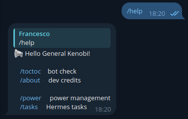

Hermes Bot
##########

Once the Hermes bot server is up and running, the user can send commands to the Telegram bot.

Help message
------------

The ``/help`` command will reply to the user by sending a message with all the available commands, providing a short description.

Setup custom commands
=====================

Hermes allows to **add custom commands to the Telegram Bot**. These commands will be automatically appended to the ``/help`` message with a description.
Please read through the :ref:`Advanced usage section<customcommands>` of this guide for more information.

.. warning::
    Custom commands allow to execute arbitrary pieces of codes. If the Hermes bot is executed with administrative priviledges, the custom commands will inherit those priviledges too.
    Please, be sure that no other user in your Linux system is able to access the Hermes configuration directory, so to avoid injection of undesired commands to the Hermes bot configuration files.
    Furthermore, be sure that no undesired user is :ref:`authorized<moreuser>` to fetch commands to the Hermes bot.

