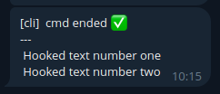

Hermes CLI
##########

The CLI of Hermes is accessible via the ``hermes`` command:

.. code-block:: bash

    hermes --about

In the following guide, I wish to quickly show the main features that are available via CLI.

|

Sending messages
================

Literally, how to send messages via the cli interface! The users that will receive the message are all the users specified in the :ref:`Hermes configuration files<confdir>`.
If more users are defined in the configuration files, it is possible to direct the message to a specific user (look at :ref:`this section<moreusercli>` in the Advanced usage documentation).

Send a text
-----------

.. code-block:: bash

    hermes -m 'Message to be sent'

Send an image or a file
-----------------------

Use the flags ``-i`` (``-f``), or explicitly ``--image`` (``--file``), to attach an image (file).

.. code-block:: bash

    hermes -m 'Message to be sent' -i picture.png

.. code-block:: bash

    hermes -m 'Message to be sent' -f attachment.pdf

|

Integrate Hermes with sh scripts
================================

It is possible to invoke Hermes inside shell scripts. For instance, let's look at the `example <https://github.com/baronefr/hermes/blob/main/examples/cli_demo.sh>`_ ``examples/cli_demo.sh`` in the GitHub repository.

.. code-block:: bash
    :emphasize-lines: 3,7

    #!/bin/bash

    hermes -m 'spawning my shell script'

    ...

    hermes -m 'the script execution is completed'

|

Run a command
=============

It is possible to execute a script/command under Hermes supervision. When the execution of the script/command is completed, Hermes will notify the user via message.

.. code-block:: bash

    hermes --exe YOURSCRIPT.sh 

It is possible to attach a message with the completion message: 

.. code-block:: bash
    
    hermes -m 'important scientific task' --exe YOURSCRIPT.sh 

If the process exit code is not zero, Hermes notifies the error status and the stderr buffer.

The ``-b`` flag puts the **execution of the script/command in background**.

.. code-block:: bash

    hermes -b -e YOURSCRIPT.sh 

Hooking function
----------------

Hermes provides a way to **extract text from stdout of the process and send it to the user** at the end of the command execution. I show an example using the `script <https://github.com/baronefr/hermes/blob/main/examples/hook.sh>`_ ``examples/hook.sh`` in the GitHub repository.

.. code-block:: bash

    hermes -e examples/hook.sh

Let's have a look at the bash script:

.. code-block:: bash
    :emphasize-lines: 2,4

    ...
    echo "%HERMES% Hooked text number one"
    echo "this text is not hooked"
    echo "%HERMES% Hooked text number two"
    ...

The lines beginning with the text ``%HERMES%`` are hooked from the stdout buffer and sent from Hermes to the user.

It is possible to customize the hook flag ``%HERMES%`` with the option ``--hook YOURHOOKFLAG``.

|

Run the Hermes bot server
=========================

The Hermes Bot functionalities require a process that executes the infinity_polling method of the Telegram Bot API. To execute the bot server, use the command:

.. code-block:: bash

    hermes --server

.. note::
    If you wish to execute the **server in background**, have a look at the :ref:`systemd setup procedure<systemdsetup>`.

|

Diagnostics and troubleshooting
===============================

Verbose mode
------------

The Hermes CLI can be invoked with a high verbosity mode to retrieve more information about possible sources of errors.

.. code-block:: bash

    hermes --verbose

Dry run
-------

A dry run might help to identify problems that occur in the setup of the Bot object. All the steps of the initialization are completed, but the Bot server is not started.

.. code-block:: bash

    hermes --verbose --dry-run

Show a list of available users
------------------------------

To list the available users:

.. code-block:: bash

    hermes --list-users

Check the installation status
-----------------------------

This command prints the installation path of the Hermes library and the environment variable that (hopefully) points to your :ref:`Hermes configuration directory<confdir>`.

.. code-block:: bash

    hermes --check