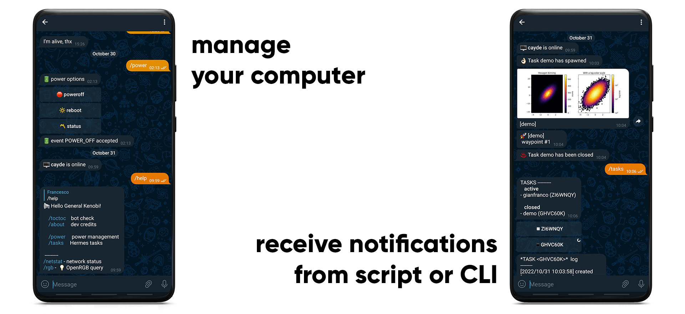

.. hermes documentation master file, created by
   sphinx-quickstart on Wed Oct  9 16:03:58 2024.
   You can adapt this file completely to your liking, but it should at least
   contain the root `toctree` directive.

Hermes
######

Hermes is a python library that provides a Telegram bot interface for your computer.
It is capable of sending messages, files or images to a specific user, either via terminal commands or inside python scripts.
Additionally, it can run as a server that interacts with specific commands received through the Telegram bot. 

In detail, the functionalities of Hermes are developed around three core blocks:

- **CLI**
    - send a text message
    - send images and files
    - send a message after the completion of a specific command/process (which can be carried out in background)
- **Bot server** - Interact with the computer running the bot to execute specific commands:
    - poweroff / reboot your system
    - retrieve power statistics
    - retrieve network status
    - *custom functions* implemented by the user
- **Tasks**
    - create a Python script using the Task module of Hermes, in order to ...
        - ... receive notifications (waypoint-based) to keep track of the script execution
        - ... send images and Matplotlib plots through the bot
        - ... create a private log file that can be retrieved through the bot server
    - failsafe mode: an error in Hermes (e.g. network is down) does not stop your code from continuing

|

.. toctree::
   :maxdepth: 2
   :caption: Get started

   setup

.. toctree::
   :maxdepth: 2
   :caption: Usage

   cli
   bot
   tasks
   advanced

.. toctree::
   :maxdepth: 3
   :caption: Documentation

   hermes
