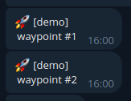
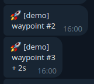

Hermes Tasks
############

An Hermes Task is an object that can be created in a Python script to provide notifications (messages, images, plots) and track the execution of your script through :ref:`waypoints<waypoints>`.

The content of this page is just a quick reference to the usage of Hermes Tasks.
For more options or detailed information, I suggest to read the Task class documentation: :py:meth:`hermes.task.task`.

Additionally, I recommend to have a look at `this Jupyter notebook <https://github.com/baronefr/hermes/blob/main/examples/task_demo.ipynb>`_ for a complete and documented example of usage.

|

Creating a Task
---------------

.. code-block:: python

    from hermes.task import task as htask
    ht = htask(alias = 'demo')

The **alias** argument is used to assign an explicit name to the task. It should be short and simple, because it is used to mark the messages that will be sent to the bot.

.. note::
    By default, the messages will be sent to all the users specified in the :ref:`Hermes configuration directory<confdir>`. To make the Task object send the messages to a specific user, or more user, check out :ref:`this paragraph<moreusertasks>` in the Advanced usage guide.

|

Sending messages and images
---------------------------

To send a message, use the method ``notify()``:

.. code-block:: python

    ht.notify('This is a demo of a task!')

To send an image, the method ``notify`` accepts as optional argument ``img`` the name of the image file to attach.

.. code-block:: python

    ht.notify(img = 'sample.jpg', txt = 'this text is attached to the picture')

Sending plots
-------------

To send a matplotlib plot, there are viable options:

* Save the plot to a file and use the method ``ht.notify(img = ...)`` to send the file.
* Pass the matplotlib figure object to the method ``ht.plotify(fig, txt='...')``.

Have a look at `this Jupyter notebook <https://github.com/baronefr/hermes/blob/main/examples/task_demo.ipynb>`_ for an explicit example.

.. _waypoints:

|

Use of waypoints
----------------

Waypoints are specific instructions in your code that will trigger the Hermes Task to send a message. 
Through waypoints, it is possible to track via messages the status of execution of your code.

.. code-block:: python
    :emphasize-lines: 5,11

    ## A long codeblock
    ...
    ...
    
    ht.waypoint() # this is waypoint #1

    ## another long codeblock
    ...
    ...

    ht.waypoint() # this is waypoint #2

The above code will send two messages:

The **waypoints are numerated** starting from 1. The counter of waypoints can be reset via the method ``ht.waypoint_reset_counter()`` method. 

Using the optional flag *timed*, ``ht.waypoint(timed=True)``, the message of the waypoint will include the time interval since the last waypoint.

|

Closing a Task
--------------

The task can be marked as closed at the end of the script.

.. code-block:: python

    ht.close()

The user will be notified via the Telegram bot that the task has been closed.
After the execution of the ``close()`` method, it is no longer possible to send messages or create waypoints.

A task can be closed with a **failure flag**, using the optional argument ``fail``:

.. code-block:: python

    ht.close(fail = 'this message is attached to the message of failure')

A task closed with the ``fail`` flag will be notified to the user with a different message (provided in the optional variable).

